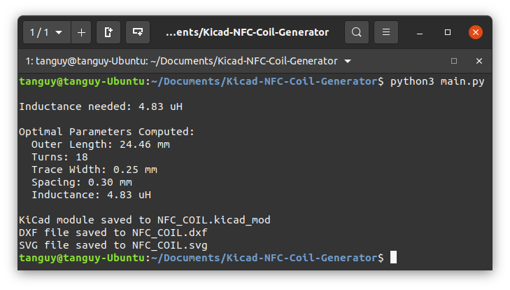
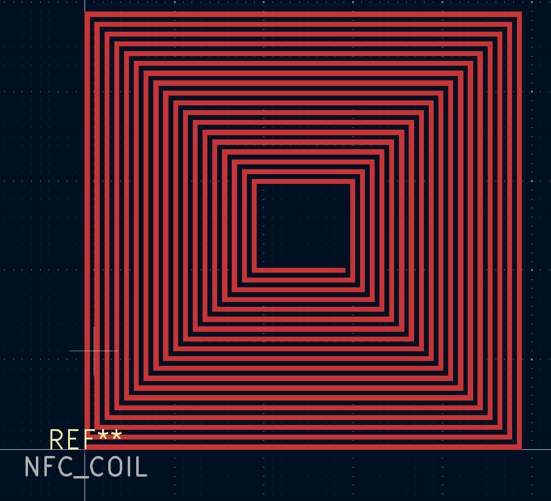
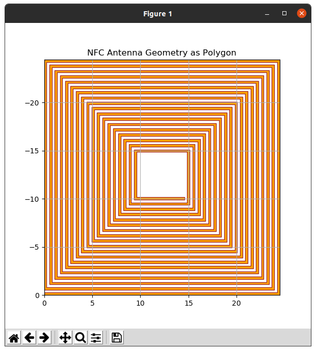

# NFC Antenna Coil Generator

### Overview
This script automates the process of computing the necessary parameters for an NFC antenna coil based on a specified capacitance. It generates the following files:
- An image of the computed coil geometry.
- A KiCad footprint (`.kicad_mod`) for use in PCB designs.
- A DXF file (`.dxf`) for 2D CAD software.
- An SVG file (`.svg`) for vector-based graphic design or other use cases.

### Features
- **Automatic coil computation**: Computes the optimal antenna coil geometry based on the resonant frequency and a given capacitance value.
- **File generation**: Generates the coil in multiple formats:
  - KiCad footprint module (`.kicad_mod`)
  - DXF file (`.dxf`)
  - SVG file (`.svg`)
  - Coil image plot.

### Installation
To run this script, you'll need the following dependencies:
- Python 3.x
- NumPy
- Matplotlib

You can install the required Python libraries with:

```bash
pip install numpy matplotlib
pip install numpy
```

### Usage
First you need to adapt the constants based on your requirements. The following parameters can be adjusted:
```Python
CAPACITANCE_CHIP = 28.5e-12 # 28.5 pF
RESONANT_FREQUENCY = 13.56e6 # 13.56 MHz

DEFAULT_MIN_LENGTH = 10
DEFAULT_MAX_LENGTH = 25
DEFAULT_STEP_LENGTH = 0.01

DEFAULT_MIN_TURNS = 5
DEFAULT_MAX_TURNS = 20
DEFAULT_STEP_TURNS = 1

DEFAULT_MIN_WIDTH = 0.25
DEFAULT_MAX_WIDTH = 1.0
DEFAULT_STEP_WIDTH = 0.05

DEFAULT_MIN_SPACING = 0.25
DEFAULT_MAX_SPACING = 1.0
DEFAULT_STEP_SPACING = 0.05
```
Then run the code with:
```bash
python3 main.py
```

# example of output




